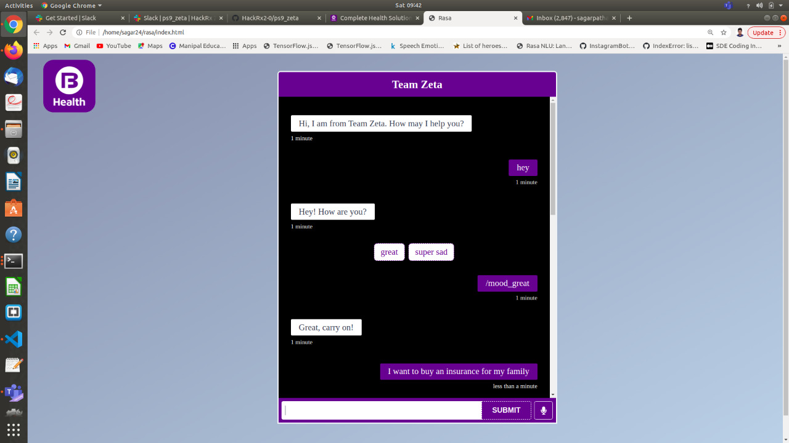
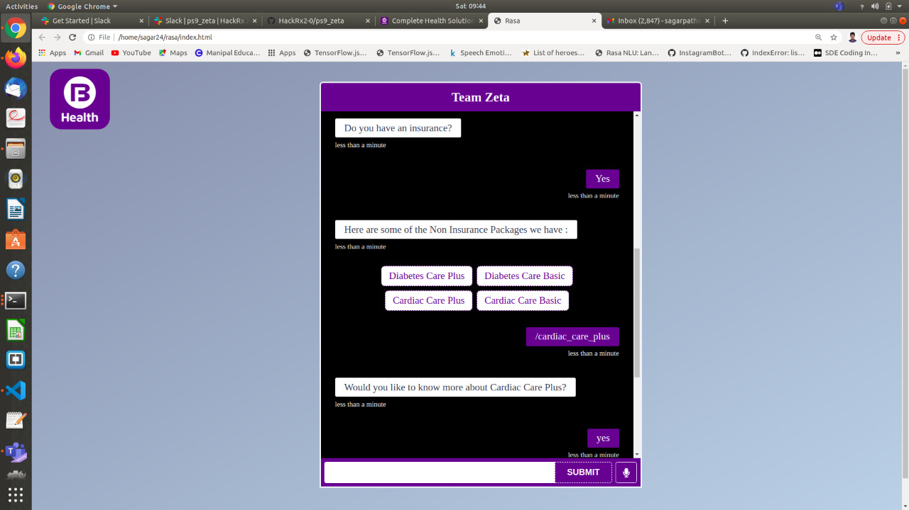
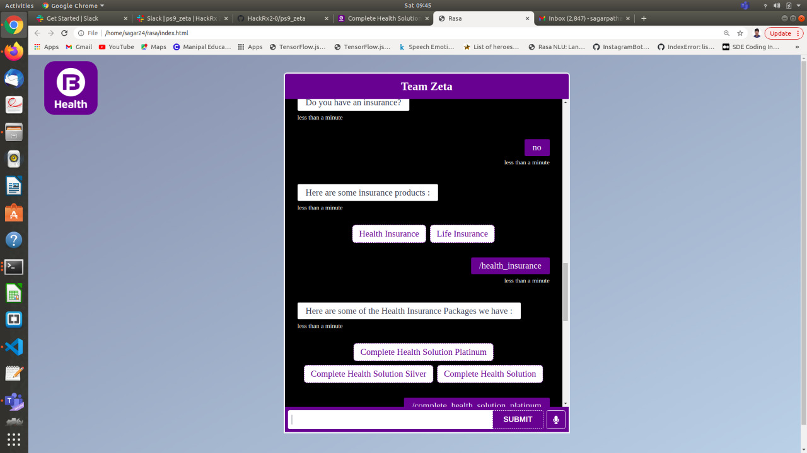
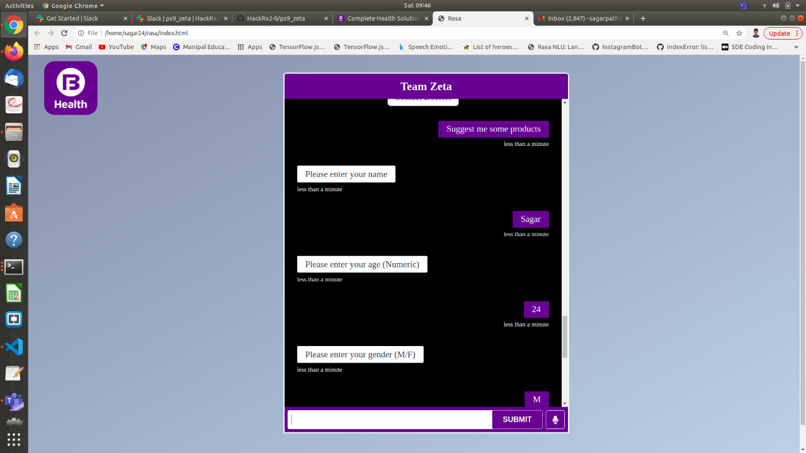
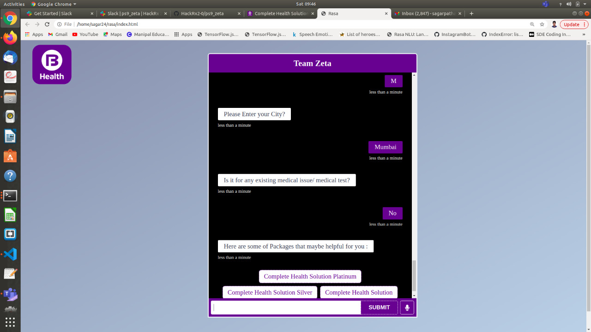

**Bringing together Bajaj Finserv’s products under a single navigation system. We aim for the chatbot to be a one stop solution for user queries, where users 
with all intents and purposes can find a solution to their queries which also includes features such as interactive voice response to enhance communication.**

*Bots Rise!*

Get your copy of the chatbot:

     $ git clone https://github.com/HackRx2-0/ps9_zeta

To fulfill minimum requirements, run the follwoing chain of commands which will test and upgrade all the packages needed to fire up your bot : 
    
     $ pip3 install --upgrade pip

     $ python3 install --upgrade python

     $ python3 -m pip install python-dev-tools --user --upgrade

Install Rasa :
    
     $ pip3 install rasa==2.1.3

Train your modules :
    
     $ rasa train

Run the following command in a new terminal to get the action server live : 

     $ rasa run actions

Your bot is now up and running! Open a second  terminal and run the following command to be able to talk to your assistant :

     $ rasa run -m models --enable-api --cors "*" --debug

After this click on the index.html file and get all your doubts cleared by the bot.

Examples

**We have implemented a full suite of IVR, i.e interactive voice response mode for the chatbot to enhance user communication and the UX. Customers can also speak and clear their doubt using the mic option instead of typing.**

Thank you for testing our bot.

Created by: 
**Team Zeta**
- Sagar Pathak  (https://github.com/Sagar2402)
- Ishan Kumar  (https://github.com/ik159)
- Shriti Chandra  (https://github.com/chandrashritii)
